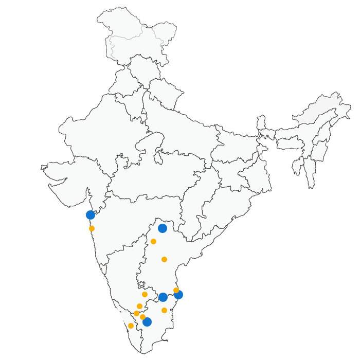

# 🗺️ India State Game 🇮🇳

A simple interactive game built with **Python Turtle** and **Pandas** to help you learn and test your knowledge of Indian states!



---

## 📌 About

This project displays a map of India and challenges the player to guess the names of Indian states. When you guess correctly, the state name appears on the map at its correct location.

---

## ⚙️ How It Works

- The game shows an India map (`Map.gif`).
- The player is prompted to guess state names.
- Correct guesses display the state name at the appropriate coordinates.
- The game keeps running until all states are correctly guessed or the user exits.

---

## 📂 Project Structure

├── India_State_Game.py # Main game script
├── Map.gif # India map image used as background
├── sates_name.csv # CSV file with state names and their coordinates
└── README.md # Project description


---

## 📋 CSV File Format

`sates_name.csv` should look like this:

| Sates      | x    | y    |
|------------|------|------|
| MAHARASHTRA | 100  | 150  |
| GUJARAT     | -50  | 200  |
| ...         | ...  | ...  |

- **Sates**: State name in uppercase.
- **x, y**: Coordinates on the map for Turtle to write the state name.

---

## 🚀 How to Run

1. Clone this repository:
    ```bash
    git clone https://github.com/Dhammu10/india-state-game.git
    ```

2. Make sure you have Python installed.

3. Install the required packages:
    ```bash
    pip install pandas
    ```

4. Run the game:
    ```bash
    python India_State_Game.py
    ```

---

## ✨ Features to Improve

- Add all Indian states and union territories.
- End game summary of missed states.
- Add score tracking.
- Make coordinates more accurate.

---

## ❤️ Contributions

PRs and suggestions are welcome! If you find any bugs or have ideas for improvement, please open an issue.

---

**Happy learning! 🇮🇳**
